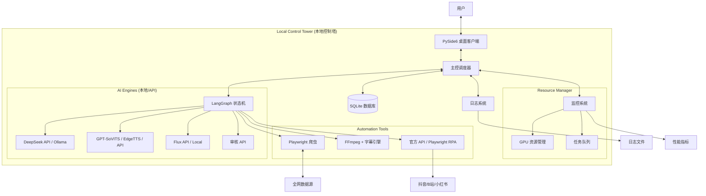
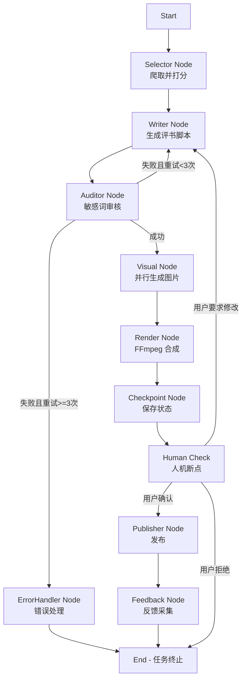

# Cyber-Pingshu Workstation 设计文档 v2.1

**项目名称：** Cyber-Pingshu Workstation (赛博评书自动化工作站)  
**版本号：** v2.1 (C/S Desktop Edition - Optimized)  
**作者：** AI 远见架构师  
**最后更新：** 2024  
**变更说明：** 基于专业评审意见优化，增加合规风险控制、技术降级方案、错误处理机制等关键设计

---

# 文档一：需求蓝图设计 (Product Requirement Blueprint)

## 1. 产品愿景 (Product Vision)

打造一套**单兵作战的桌面端自动化内容工厂**。  
通过"旧瓶装新酒"的策略，利用传统的评书艺术形式解构现代科技与社会热点。核心在于构建**"全自动化的数据飞轮"**：从全网热点捕捉，到 AI 风格化演绎，再到全平台自动化发布与反馈学习，实现**渐进式自动化**的内容资产增值。

### 1.1 MVP 阶段规划

**Phase 1 (MVP - 核心功能验证):**
- ✅ 热点爬取与智能评分
- ✅ 脚本生成与风格化处理
- ✅ 视频合成与预览
- ⚠️ 发布功能：**手动上传**（降低合规风险）

**Phase 2 (增强自动化):**
- ✅ 增加官方 API 发布支持
- ✅ 反馈数据采集与策略优化

**Phase 3 (全自动化):**
- ⚠️ RPA 发布（仅作为最后手段，需明确风险提示）

## 2. 核心 IP 设定 (Core Identity)

* **角色名称：** 赛博说书人·零号先生 (Master Zero)
* **角色设定：** 来自 2077 年的数据考古学家，赛博朋克风格，身穿全息长衫，手持激光醒木。
* **声音特征：** 原创"烟嗓"音色（避开单田芳声纹风险），语速中等偏慢，注重抑扬顿挫与"留扣子"。
* **视觉风格：** **Cyber-Ink (赛博水墨风)**。黑白水墨基调 + 霓虹色点缀 + 故障艺术 (Glitch Art)。

## 3. 用户旅程地图 (User Journey)

1. **启动 (Start):** 用户打开桌面客户端，点击"启动雷达"。
2. **决策 (Decide):** 系统自动推荐 Top 5 选题，用户勾选其中 1 个（或全选）。
3. **生产 (Produce):** 
   - 用户点击"开始铸造"，系统进入后台全自动作业
   - **实时进度反馈：** 显示当前节点（脚本生成中/配音中/配图中/剪辑中）和进度百分比
   - **可中断机制：** 用户可随时暂停/取消任务
   - 流程：生成脚本 → 配音 → 配图 → 剪辑
4. **预览 (Preview):** 
   - 生产完成后弹窗预览
   - 用户可选择：**确认发布** / **修改重试** / **放弃**
5. **分发 (Distribute):** 
   - **优先方案：** 使用平台官方 API 自动上传（B站、抖音开放平台）
   - **备选方案：** RPA 模拟操作（需用户明确同意风险提示）
   - 支持定时发布和批量发布
6. **进化 (Evolve):** 
   - 系统自动抓取评论数据（支持自定义时间窗口：6h/12h/24h/48h）
   - 优化下一轮的 Prompt 策略和选题权重

## 4. 功能模块详述 (Functional Specs)

### 模块 A：全网雷达 (Content Radar)

* **F1.1 多源热点采集:**
  * **数据源：** 知乎（科技榜）、微博（热搜）、36Kr（快讯）、抖音（热点榜）
  * **爬取频率：** 
    - 知乎：1次/小时
    - 微博：1次/30分钟
    - 36Kr：1次/小时
    - 抖音：1次/小时
  * **反爬策略：** 
    - 遵守 robots.txt 协议
    - 随机 User-Agent 轮换
    - 请求间隔随机化（3-10秒）
    - 使用 Playwright 模拟真实浏览器行为
  * **去重机制：** 基于标题相似度（TF-IDF + 余弦相似度）过滤重复选题
  * **黑名单机制：** 自动记录已处理选题，避免重复生成

* **F1.2 智能评分系统:**
  * **机制：** 引入 3 个虚拟编辑 Agent（老学究、乐子人、数据党）对选题进行交叉打分
  * **Agent Prompt 设计:**
    ```
    老学究 Agent: 关注选题的深度、知识性和教育价值
    乐子人 Agent: 关注选题的趣味性、话题性和传播潜力
    数据党 Agent: 关注选题的热度趋势、数据表现和时效性
    ```
  * **评分算法：**
    ```
    综合得分 = (老学究得分 × 0.3) + (乐子人得分 × 0.4) + (数据党得分 × 0.3)
    最终推荐指数 = 综合得分 × 时效性系数 (0.8-1.2)
    ```
  * **输出：** 综合推荐指数（0-10分），自动过滤低质/敏感话题
  * **敏感话题过滤：** 本地敏感词库 + LLM 语义审核（调用审核 API）

### 模块 B：评书铸造车间 (The Forge)

* **F2.1 风格化脚本引擎:**
  * **结构强制：** 定场诗 → 开场白 → 正文（三翻四抖） → 结尾留扣子 → [下回分解]
  * **术语转译表：**
    ```
    服务器 → 藏经阁
    Bug → 走火入魔
    程序员 → 符文师
    数据库 → 天书库
    算法 → 心法
    代码 → 符咒
    调试 → 调息
    部署 → 出关
    ```
  * **字数控制：** 支持动态调整（默认 800-1200 字，可根据反馈优化）
  * **Prompt 模板：** 包含角色设定、风格要求、结构约束

* **F2.2 混合视觉系统 (Hybrid Visuals):**
  * **通用层：** 预设 50+ 张高质量赛博说书人动态循环素材（.mp4），随机轮播（覆盖 70% 时长）
  * **特写层：** 根据脚本关键情节，实时生成特写图片（覆盖 30% 时长）
  * **图片生成方案（降级策略）：**
    1. **优先方案：** Flux API（Replicate / Stability AI）- 快速、稳定
    2. **备选方案：** Flux 本地部署（需 RTX 4070+ 或 RTX 3090，显存 ≥16GB）
    3. **降级方案：** DALL-E 3 / Midjourney API
  * **视觉增强：** 
    - Ken Burns Effect（镜头推拉摇移）算法处理静态图
    - 随机运动轨迹，避免视觉疲劳
    - 支持故障艺术（Glitch Art）特效

* **F2.3 沉浸式听觉:**
  * **TTS 方案（降级策略）：**
    1. **优先方案：** GPT-SoVITS 本地部署（需预先训练"烟嗓"模型）
    2. **备选方案：** EdgeTTS + 音色克隆 API（如 ElevenLabs）
    3. **降级方案：** EdgeTTS 标准音色
  * **情感控制：** 
    - 情感标签体系：激昂、低沉、诙谐、严肃、神秘
    - 根据脚本内容自动匹配情感标签
    - 支持手动调整情感强度（0-100%）
  * **音效库：** 
    - 自动插入时机算法：
      - 定场诗结束 → 醒木音效
      - "留扣子"处 → 醒木 + 折扇音效
      - 关键转折 → 电子故障音
      - 结尾 → 观众喝彩（可选）
    - 音效库包含：醒木.mp3、折扇.wav、笑声.wav、电子故障音.mp3

### 模块 C：合规与合成 (Compliance & Render)

* **F3.1 多层审核机制:**
  * **第一层：** 本地敏感词库匹配（快速过滤）
  * **第二层：** LLM 语义审核（调用审核 API，如 OpenAI Moderation API）
  * **第三层：** 用户人工审核（Human Check 节点）
  * **审核结果处理：**
    - 通过 → 继续流程
    - 不通过 → 记录原因，回退至 Writer Node 重试（最多 3 次）
    - 3 次失败 → 终止任务，提示用户手动修改

* **F3.2 自动化剪辑:**
  * **字幕对齐技术：**
    - 方案 A：使用 TTS 返回的时间戳（精确到毫秒）
    - 方案 B：ASR 识别音频，提取时间戳（备用方案）
    - 字幕样式配置：字体（思源黑体）、颜色（霓虹绿 #00FF41）、位置（底部 1/4）、描边（黑色 2px）
  * **视频参数：**
    - 分辨率：1080P (1080×1920)
    - 帧率：60fps
    - 编码：H.264 (NVENC 硬件编码，如可用)
    - 码率：8-10 Mbps
  * **水印：** 自动添加半透明 Logo（右下角，不遮挡内容）
  * **封面生成：** 自动从视频中提取关键帧，添加标题文字

### 模块 D：矩阵发布与反馈 (Publish & Feedback)

* **F4.1 发布策略（合规优先）:**
  * **优先级排序：**
    1. **官方 API（推荐）：** 
       - B站开放平台 API
       - 抖音开放平台 API
       - 小红书开放平台 API（如有）
    2. **RPA 方案（高风险，需用户明确同意）：**
       - 使用 `undetected-playwright` 库
       - 保存本地 Browser Profile（保留登录态）
       - 随机延迟（3-8秒）
       - **风险提示：** 在 UI 中明确告知用户可能违反平台 ToS，存在账号封禁风险
       - **账号隔离策略：** 建议使用独立测试账号
  * **发布功能：**
    - 封面上传
    - 标题自动填写（支持模板变量）
    - 标签自动填写（基于脚本关键词）
    - 定时发布（支持批量任务）
    - 发布状态追踪

* **F4.2 舆情回采:**
  * **采集时机：** 支持自定义时间窗口（6h/12h/24h/48h），默认 24h
  * **采集内容：**
    - 播放量、点赞数、评论数、转发数
    - 评论内容（前 100 条）
    - 评论情感分析（使用 LLM 或情感分析模型）
  * **关键词提取：** 使用 TF-IDF + 关键词提取算法，识别高频反馈词

* **F4.3 策略自进化:**
  * **反馈学习规则：**
    ```
    如果评论区出现"太啰嗦" → 下调脚本字数阈值（-10%）
    如果评论区出现"催更" → 该类选题权重 +1
    如果评论区出现"听不懂" → 简化术语转译表
    如果播放量 < 预期 → 调整选题评分权重
    ```
  * **Prompt 优化：** 根据反馈数据自动调整 Writer Node 的 Prompt 模板
  * **权重更新：** 定期（每周）重新计算选题评分权重

## 5. 非功能需求 (NFR)

* **部署环境：** 
  - Windows 10/11（推荐）
  - macOS（可选，需测试）
  - Linux（可选，需测试）
  - **硬件要求：**
    - 最低：NVIDIA RTX 3060 (12GB) + 16GB RAM
    - 推荐：NVIDIA RTX 4070 (12GB) 或 RTX 3090 (24GB) + 32GB RAM
    - 存储：至少 100GB 可用空间（模型文件 + 产出物）

* **响应性能：** 
  - 单视频（1分钟）生成时间 < 5分钟（使用 API 方案）
  - 单视频（1分钟）生成时间 < 10分钟（使用本地模型）
  - UI 响应时间 < 100ms（不阻塞主线程）

* **数据隐私：** 
  - 所有素材、Cookie、模型文件存储于本地，不上传云端
  - Cookie 和 Browser Profile 使用加密存储（AES-256）
  - 支持数据备份和恢复

* **可靠性：** 
  - 系统可用性 > 95%
  - 任务成功率 > 90%（排除用户取消）
  - 支持断点续传（任务中断后可恢复）

* **可维护性：** 
  - 代码模块化，易于扩展
  - 完整的日志系统（分级记录）
  - 支持配置热更新（无需重启）

## 6. 成本估算 (Cost Estimation)

| 项目 | 月成本估算 | 备注 |
|------|-----------|------|
| **DeepSeek API** | ¥200-500 | 按 100 视频/月，每次 5K tokens |
| **Flux API (Replicate)** | ¥300-800 | 按 100 视频/月，每次 5 张图 |
| **TTS API (可选)** | ¥100-300 | 如使用 ElevenLabs 等 |
| **审核 API (可选)** | ¥50-150 | OpenAI Moderation API |
| **存储（本地）** | ¥0 | 但需考虑硬盘空间（约 50GB/100视频） |
| **GPU 电费** | ¥100-200 | 按 RTX 4070，每天 2 小时 |
| **总计（API 方案）** | **¥750-1950/月** | 不含硬件成本 |
| **总计（本地方案）** | **¥300-700/月** | 仅 API 调用成本，不含硬件 |

---

# 模型与服务选型 (OpenRouter 优先、缺口与本地兜底)

## 1. OpenRouter 能力现状（以 openrouter.ai/models 实际可见为准）
- **文本 LLM（可用）：** GPT-4.1 / 4.1-mini、Claude 3.5/3.7/4.5、Gemini 2.5/3 Pro、DeepSeek V3/R1、Llama 3.x、Mistral/Mixtral、Phi-4 等。
- **审核：** 若列表中有 OpenAI moderation 类模型可直接使用，需以账号实际可见为准。
- **嵌入：** 部分时间段提供 `text-embedding-3` 等模型，需以实际列表为准。
- **缺口较大：** 图像生成（Flux/SD/DALL·E 未必有）、TTS、ASR。

## 2. 能力缺口与补齐策略
- **图像生成（封面/特写）：** 优先外部云 API（OpenAI Images/DALL·E 3、Stability/SD API、Replicate 的 Flux/SDXL）。本地 M4 Pro 不跑大模型，只做裁剪/字幕/滤镜后处理。
- **TTS：** 云优先（ElevenLabs / OpenAI TTS / Azure TTS）；本地备选 `piper` 小模型（Metal 可实时）；SoVITS 本地仅作备用，成本高。
- **ASR/时间戳：** 云（OpenAI Whisper / Deepgram / AssemblyAI）为主；本地兜底 `whisper.cpp` small/medium 量化 + Metal。
- **审核：** 若 OpenRouter 无 moderation，则接 OpenAI/Azure Content Safety；本地兜底敏感词表 + 轻量分类（7B gguf）。
- **嵌入/RAG：** 若 OpenRouter 有则复用；否则接 OpenAI/Voyage/Cohere；本地兜底 `nomic-embed-text` gguf（Metal）。

## 3. 模型路由与降级规则
- **主路：** OpenRouter 文本 LLM（按质量/成本自动分流：gpt-4.1/claude-sonnet → mini/haiku → 本地 7B）。
- **图像：** 外部图像 API（首选 DALL·E/SD/Flux），失败再切其他云；无本地大模型生成。
- **语音：** 云 TTS/ASR → 本地 `piper` / `whisper.cpp` 兜底。
- **审核：** OpenRouter moderation（如有）→ 专用审核 API → 本地敏感词/轻量分类。
- **成本/预算控制：** UI 显示预估 token/图像调用成本，超预算自动降级到小杯或本地。

## 4. MacOS M4 Pro 本地部署建议（仅兜底/离线/隐私）
- **LLM：** `llama.cpp` gguf 7B/13B q4/q5，threads≈6-8，并发=1，context 4k-8k，n_gpu_layers=all（Metal）。
- **ASR：** `whisper.cpp` small/medium 量化，1 分钟音频可准实时。
- **TTS：** `piper` 小模型实时可用。
- **图像：** 不跑大模型生成，仅做后处理。
- **资源与温控：** 限制并发 GPU 任务=1，监控芯片温度/功耗，超阈值暂停或降级。

## 5. 配置补充示例（片段）
```yaml
providers:
  openrouter:
    api_key: ${OPENROUTER_API_KEY}
    base_url: https://openrouter.ai/api/v1
    models:
      text_primary: gpt-4.1
      text_cost_saver: gpt-4.1-mini
      text_alt: claude-3.7-sonnet
      text_backup: phi-4
      moderation: null    # 若无则为 null，走外部审核 API
      embedding: null     # 若有 text-embedding-3 可填其名称

  images:
    primary: openai-images      # or dalle-3
    secondary: stability-sdxl   # via Stability/Replicate
    flux: replicate-flux        # 可选通道

  tts:
    primary: elevenlabs
    secondary: openai-tts
    local_fallback: piper

  asr:
    primary: openai-whisper
    secondary: deepgram
    local_fallback: whisper.cpp

local:
  llama_cpp:
    model_path: ./models/llama-3-8b-q4.gguf
    threads: 6
    ctx: 4096
    n_gpu_layers: -1   # all layers offloaded (Metal)
  whisper_cpp:
    model_path: ./models/whisper-medium-q5_1.bin
```

---

# 文档二：架构设计 (Architecture Design)

**项目名称：** Cyber-Pingshu Workstation  
**架构模式：** C/S (Client/Server) - 本地富客户端架构  
**核心框架：** PySide6 (GUI) + LangGraph (逻辑编排) + Playwright (RPA)

## 1. 系统拓扑图 (System Topology)



## 2. 核心技术栈 (Tech Stack)

| 层级 | 技术选型 | 理由 | 备选方案 |
| :--- | :--- | :--- | :--- |
| **交互层 (UI)** | **PySide6 (Qt)** | 跨平台、支持多线程不卡顿、界面美观专业 | PyQt6 |
| **逻辑层 (Logic)** | **LangGraph** | 处理复杂的循环逻辑、状态管理、人机协同 | Temporal, Prefect |
| **数据层 (Data)** | **SQLite** | 轻量级、无需安装服务、单文件存储方便迁移 | PostgreSQL (可选) |
| **浏览器自动化** | **Playwright** | 比 Selenium 更快，支持无头模式，抗指纹检测能力强 | Selenium |
| **多媒体核心** | **FFmpeg (CLI)** | 视频处理工业标准，性能最强 | MoviePy (性能较差) |
| **大模型接入** | **OpenAI SDK** | 兼容 DeepSeek/Moonshot 等主流 API 格式 | Anthropic SDK |
| **任务队列** | **asyncio + Queue** | Python 原生，轻量级 | Celery (可选) |
| **日志系统** | **logging + structlog** | Python 标准库 + 结构化日志 | loguru |
| **监控系统** | **psutil** | 系统资源监控 | - |

## 3. LangGraph 状态机设计 (State Machine)

这是系统的"大脑"，定义了视频生产的严谨流程。

### 3.1 State Schema (状态定义)

```python
from typing import TypedDict, List, Dict, Optional
from datetime import datetime

class AgentState(TypedDict):
    # ========== 核心数据 ==========
    topic: str                    # 选题
    script: str                   # 脚本
    segments: List[Dict]          # 分镜列表 [{"type": "carousel|flux", "path": "...", "duration": 5.0}]
    video_path: str               # 成片路径
    audio_path: str               # 音频路径
    cover_path: str               # 封面路径
    
    # ========== 控制流 ==========
    audit_result: bool           # 审核结果
    retry_count: int              # 重试次数
    current_node: str             # 当前节点名称
    error_message: Optional[str]  # 错误信息
    user_feedback: Optional[str]  # 用户反馈 (approve/reject/modify)
    
    # ========== 进度与元数据 ==========
    progress: float               # 进度百分比 (0-100)
    metadata: Dict                # 元数据 {
                                  #   "start_time": datetime,
                                  #   "script_gen_time": float,
                                  #   "tts_time": float,
                                  #   "img_gen_time": float,
                                  #   "render_time": float,
                                  #   "total_tokens": int,
                                  #   "gpu_memory_used": float
                                  # }
    
    # ========== 持久化标识 ==========
    task_id: str                  # 任务唯一标识 (UUID)
    checkpoint_path: Optional[str] # 检查点路径
    status: str                   # pending/running/completed/failed/cancelled
```

### 3.2 Workflow Nodes (节点流转)



**节点详细说明：**

1. **Selector Node:**
   - 功能：爬取热点并打分
   - 输入：无
   - 输出：`topic` (选题)
   - 错误处理：网络错误重试 3 次，失败则终止

2. **Writer Node:**
   - 功能：生成评书脚本
   - 输入：`topic`
   - 输出：`script`
   - 错误处理：API 调用失败重试 3 次（指数退避）

3. **Auditor Node (Gate):**
   - 功能：多层审核（敏感词 + 语义审核）
   - 输入：`script`
   - 输出：`audit_result`
   - 条件分支：
     - 失败且 `retry_count < 3` → 回退至 **Writer Node**，`retry_count += 1`
     - 失败且 `retry_count >= 3` → 跳转至 **ErrorHandler Node**
     - 成功 → 前进至 **Visual Node**

4. **Visual Node:**
   - 功能：并行生成 Flux 特写图 + 选取通用素材
   - 输入：`script`
   - 输出：`segments` (分镜列表)
   - 并行策略：
     - 使用 `asyncio.gather()` 并行调用 Flux API（最多 5 张图）
     - 通用素材随机选取（不阻塞）
   - 错误处理：图片生成失败使用备用素材

5. **Render Node:**
   - 功能：调用 FFmpeg 合成视频
   - 输入：`segments`, `audio_path`
   - 输出：`video_path`
   - 错误处理：FFmpeg 失败重试 2 次

6. **Checkpoint Node:**
   - 功能：保存状态到数据库和文件系统
   - 输入：完整 `AgentState`
   - 输出：`checkpoint_path`
   - 触发时机：每个关键节点完成后

7. **Human Check (Breakpoint):**
   - 功能：等待用户确认
   - 输入：`video_path`
   - 输出：`user_feedback` (approve/reject/modify)
   - 条件分支：
     - `approve` → 前进至 **Publisher Node**
     - `reject` → 终止任务
     - `modify` → 回退至 **Writer Node**（用户可手动修改 Prompt）

8. **Publisher Node:**
   - 功能：执行发布（优先官方 API，备选 RPA）
   - 输入：`video_path`, `cover_path`
   - 输出：发布状态
   - 错误处理：发布失败记录日志，不阻塞流程

9. **Feedback Node:**
   - 功能：采集反馈数据（异步，不阻塞）
   - 输入：`production_id`
   - 输出：反馈数据写入数据库
   - 执行时机：发布后延迟执行（根据配置的时间窗口）

10. **ErrorHandler Node:**
    - 功能：统一错误处理
    - 输入：`error_message`, `current_node`
    - 输出：错误日志、用户提示
    - 处理策略：
      - 记录错误到数据库
      - 发送错误通知到 UI
      - 清理临时文件
      - 更新任务状态为 `failed`

### 3.3 断点续传机制

- **检查点保存：** 每个关键节点完成后自动保存状态到数据库
- **恢复流程：** 
  1. 用户点击"恢复任务"
  2. 系统从数据库加载最新检查点
  3. 反序列化 `AgentState`
  4. 从 `current_node` 继续执行
- **状态持久化：** 使用 SQLite 的 `tasks` 表存储序列化的状态 JSON

## 4. 数据库设计 (Database Schema)

### 4.1 核心表设计

#### Table: `topics` (选题库)

| 字段名 | 类型 | 约束 | 描述 |
| :--- | :--- | :--- | :--- |
| `id` | INTEGER | PK, AUTO_INCREMENT | 主键 |
| `source_url` | TEXT | NOT NULL | 来源链接 |
| `title` | TEXT | NOT NULL | 标题 |
| `content` | TEXT | | 原始内容（可选） |
| `score_ai` | REAL | | AI 评分 (0-10) |
| `tags` | TEXT | | 标签（JSON 格式） |
| `status` | TEXT | DEFAULT 'pending' | pending / used / discarded |
| `created_at` | DATETIME | DEFAULT CURRENT_TIMESTAMP | 创建时间 |
| `updated_at` | DATETIME | DEFAULT CURRENT_TIMESTAMP | 更新时间 |

**索引：**
- `idx_status_score`: (`status`, `score_ai` DESC)
- `idx_created_at`: (`created_at`)

#### Table: `productions` (作品库)

| 字段名 | 类型 | 约束 | 描述 |
| :--- | :--- | :--- | :--- |
| `id` | INTEGER | PK, AUTO_INCREMENT | 主键 |
| `topic_id` | INTEGER | FK → topics.id | 关联选题 |
| `task_id` | TEXT | UNIQUE | 任务唯一标识 |
| `script_content` | TEXT | NOT NULL | 脚本全文 |
| `video_path` | TEXT | | 本地路径 |
| `audio_path` | TEXT | | 音频路径 |
| `cover_path` | TEXT | | 封面路径 |
| `duration` | INTEGER | | 视频时长（秒） |
| `file_size` | INTEGER | | 文件大小（字节） |
| `status` | TEXT | DEFAULT 'draft' | draft / completed / published / failed |
| `created_at` | DATETIME | DEFAULT CURRENT_TIMESTAMP | 创建时间 |
| `updated_at` | DATETIME | DEFAULT CURRENT_TIMESTAMP | 更新时间 |

**索引：**
- `idx_topic_id`: (`topic_id`)
- `idx_status`: (`status`)
- `idx_created_at`: (`created_at`)

#### Table: `feedbacks` (数据回环)

| 字段名 | 类型 | 约束 | 描述 |
| :--- | :--- | :--- | :--- |
| `id` | INTEGER | PK, AUTO_INCREMENT | 主键 |
| `production_id` | INTEGER | FK → productions.id | 关联作品 |
| `platform` | TEXT | NOT NULL | 平台 (douyin/bilibili/xiaohongshu) |
| `platform_video_id` | TEXT | | 平台视频 ID |
| `views` | INTEGER | DEFAULT 0 | 播放量 |
| `likes` | INTEGER | DEFAULT 0 | 点赞数 |
| `comments` | INTEGER | DEFAULT 0 | 评论数 |
| `shares` | INTEGER | DEFAULT 0 | 转发数 |
| `comments_sentiment` | REAL | | 评论情感分 (-1 to 1) |
| `extracted_keywords` | TEXT | | 关键词提取（JSON 格式） |
| `collected_at` | DATETIME | DEFAULT CURRENT_TIMESTAMP | 反馈采集时间 |

**索引：**
- `idx_production_id`: (`production_id`)
- `idx_platform`: (`platform`)

### 4.2 扩展表设计

#### Table: `tasks` (任务执行历史)

| 字段名 | 类型 | 约束 | 描述 |
| :--- | :--- | :--- | :--- |
| `id` | INTEGER | PK, AUTO_INCREMENT | 主键 |
| `task_id` | TEXT | UNIQUE, NOT NULL | 任务唯一标识 |
| `state_json` | TEXT | | LangGraph 状态序列化（JSON） |
| `current_node` | TEXT | | 当前节点名称 |
| `status` | TEXT | DEFAULT 'pending' | pending / running / completed / failed / cancelled |
| `error_message` | TEXT | | 错误信息 |
| `progress` | REAL | DEFAULT 0 | 进度百分比 (0-100) |
| `created_at` | DATETIME | DEFAULT CURRENT_TIMESTAMP | 创建时间 |
| `updated_at` | DATETIME | DEFAULT CURRENT_TIMESTAMP | 更新时间 |
| `completed_at` | DATETIME | | 完成时间 |

**索引：**
- `idx_task_id`: (`task_id`)
- `idx_status`: (`status`)

#### Table: `platform_accounts` (平台账号管理)

| 字段名 | 类型 | 约束 | 描述 |
| :--- | :--- | :--- | :--- |
| `id` | INTEGER | PK, AUTO_INCREMENT | 主键 |
| `platform` | TEXT | NOT NULL | 平台名称 |
| `username` | TEXT | | 用户名 |
| `api_key` | TEXT | | API Key（加密存储） |
| `profile_path` | TEXT | | Browser Profile 路径（RPA 方案） |
| `last_login_at` | DATETIME | | 最后登录时间 |
| `status` | TEXT | DEFAULT 'active' | active / banned / suspended |
| `created_at` | DATETIME | DEFAULT CURRENT_TIMESTAMP | 创建时间 |

**索引：**
- `idx_platform_status`: (`platform`, `status`)

#### Table: `sensitive_words` (敏感词库)

| 字段名 | 类型 | 约束 | 描述 |
| :--- | :--- | :--- | :--- |
| `id` | INTEGER | PK, AUTO_INCREMENT | 主键 |
| `word` | TEXT | UNIQUE, NOT NULL | 敏感词 |
| `level` | INTEGER | DEFAULT 1 | 敏感级别 (1-3) |
| `category` | TEXT | | 分类（政治/色情/暴力等） |
| `created_at` | DATETIME | DEFAULT CURRENT_TIMESTAMP | 创建时间 |

**索引：**
- `idx_word`: (`word`)

## 5. 配置管理设计 (Configuration Management)

### 5.1 配置文件结构 (`config.yaml`)

```yaml
# API 配置
api:
  deepseek:
    api_key: ${DEEPSEEK_API_KEY}  # 从环境变量读取
    base_url: https://api.deepseek.com
    model: deepseek-chat
    max_tokens: 2000
    temperature: 0.7
    timeout: 30
  
  replicate:
    api_key: ${REPLICATE_API_KEY}
    flux_model: black-forest-labs/flux-dev
    
  elevenlabs:
    api_key: ${ELEVENLABS_API_KEY}
    voice_id: default
    
  moderation:
    provider: openai  # openai / local
    api_key: ${OPENAI_API_KEY}

# 路径配置
paths:
  assets: ./assets
  output: ./output
  db: ./db/studio.db
  logs: ./logs
  checkpoints: ./checkpoints
  models: ./models

# 模型配置
models:
  flux:
    provider: api  # api | local
    model_path: ./models/flux
    batch_size: 1
    max_retries: 3
    
  tts:
    provider: local  # local | api
    model_path: ./models/gpt-sovits
    voice_name: master_zero
    emotion_enabled: true

# 平台配置
platforms:
  bilibili:
    enabled: true
    use_api: true  # true: 官方API, false: RPA
    api_key: ${BILIBILI_API_KEY}
    api_secret: ${BILIBILI_API_SECRET}
    profile_path: ./assets/profiles/bilibili
    
  douyin:
    enabled: false
    use_api: true
    api_key: ${DOUYIN_API_KEY}
    
  xiaohongshu:
    enabled: false
    use_api: false  # 暂无官方API，使用RPA
    profile_path: ./assets/profiles/xiaohongshu

# 爬虫配置
spider:
  zhihu:
    enabled: true
    interval: 3600  # 秒
    max_items: 20
    
  weibo:
    enabled: true
    interval: 1800
    max_items: 30
    
  douyin:
    enabled: true
    interval: 3600
    max_items: 20

# 视频配置
video:
  resolution: "1080x1920"
  fps: 60
  codec: "h264"
  bitrate: "8M"
  subtitle:
    font: "Source Han Sans CN"
    size: 48
    color: "#00FF41"
    position: "bottom"
    margin: 50

# 审核配置
audit:
  sensitive_word_check: true
  semantic_check: true
  max_retries: 3
  retry_delay: 1  # 秒

# 反馈配置
feedback:
  enabled: true
  collection_window: 86400  # 24小时（秒）
  platforms: ["bilibili", "douyin"]

# 性能配置
performance:
  max_concurrent_tasks: 1  # 最大并发任务数
  gpu_memory_limit: 0.8  # GPU 内存使用上限（80%）
  enable_checkpoint: true
  checkpoint_interval: 60  # 秒

# 日志配置
logging:
  level: INFO  # DEBUG / INFO / WARNING / ERROR
  format: json  # json / text
  file_rotation: true
  max_file_size: 10  # MB
  backup_count: 5
```

### 5.2 配置加载与验证

- **配置加载：** 使用 `pyyaml` 加载 YAML 文件
- **环境变量替换：** 支持 `${VAR_NAME}` 语法，从环境变量读取敏感信息
- **配置验证：** 启动时验证配置完整性，缺失必填项则报错
- **热更新：** 支持部分配置热更新（如爬虫间隔、API Key），无需重启

### 5.3 敏感信息加密

- **加密算法：** AES-256-GCM
- **密钥管理：** 使用系统密钥库（Windows: DPAPI, macOS: Keychain）
- **加密字段：** API Key、Browser Profile Cookie、用户密码

## 6. 错误处理机制设计 (Error Handling)

### 6.1 异常分类

```python
class CyberPingshuException(Exception):
    """基础异常类"""
    pass

class NetworkError(CyberPingshuException):
    """网络错误（可重试）"""
    pass

class APIError(CyberPingshuException):
    """API 调用错误（可重试）"""
    pass

class ValidationError(CyberPingshuException):
    """数据验证错误（不可重试）"""
    pass

class ResourceError(CyberPingshuException):
    """资源错误（显存不足等，需等待）"""
    pass

class UserCancelledError(CyberPingshuException):
    """用户取消（正常流程）"""
    pass
```

### 6.2 重试策略

- **指数退避：** 重试间隔 = `base_delay * (2 ^ retry_count)`，最大延迟 60 秒
- **最大重试次数：** 根据异常类型设置（网络错误 3 次，API 错误 3 次，资源错误 5 次）
- **重试条件：** 仅对可重试异常进行重试（NetworkError, APIError, ResourceError）

### 6.3 错误日志

- **日志级别：** ERROR（错误）、WARNING（警告）、INFO（信息）、DEBUG（调试）
- **日志格式：** 结构化 JSON 格式，包含时间戳、任务ID、节点名称、错误类型、错误消息、堆栈跟踪
- **日志存储：** 本地文件（`logs/app.log`），支持日志轮转

### 6.4 用户错误提示

- **错误弹窗：** 关键错误（如任务失败）显示用户友好的错误提示
- **错误详情：** 提供"查看详情"按钮，显示技术错误信息（供调试）
- **错误恢复建议：** 根据错误类型提供恢复建议（如"网络连接失败，请检查网络后重试"）

## 7. 监控与日志系统 (Monitoring & Logging)

### 7.1 系统监控

- **监控指标：**
  - CPU 使用率
  - GPU 使用率（显存、算力）
  - 内存使用率
  - 磁盘使用率
  - 网络流量
- **监控工具：** `psutil` + 自定义监控模块
- **监控展示：** UI 中显示实时资源使用情况（可选）

### 7.2 任务监控

- **任务状态：** 实时更新任务状态（pending/running/completed/failed）
- **任务进度：** 实时更新进度百分比
- **任务耗时：** 记录各节点耗时，用于性能分析
- **任务历史：** 保存任务执行历史，支持查询和统计

### 7.3 日志系统

- **日志框架：** `structlog`（结构化日志）
- **日志输出：** 
  - 控制台输出（开发环境）
  - 文件输出（生产环境）
  - 可选：远程日志服务（如 Sentry）
- **日志轮转：** 按文件大小轮转（10MB），保留最近 5 个文件

### 7.4 性能分析

- **性能指标：** 
  - 各节点平均耗时
  - API 调用成功率
  - 任务成功率
  - 资源使用峰值
- **性能报告：** 定期生成性能报告（每周），识别性能瓶颈

## 8. 本地目录结构 (File Structure)

```text
CyberPingshu/
├── app.py                      # 启动入口 (PySide6 Main)
├── config.yaml                 # 配置文件
├── requirements.txt            # Python 依赖
├── README.md                   # 项目说明
├── core/                       # 核心逻辑
│   ├── __init__.py
│   ├── graph.py                # LangGraph 工作流定义
│   ├── nodes/                  # 工作流节点
│   │   ├── __init__.py
│   │   ├── selector.py         # 选题节点
│   │   ├── writer.py           # 脚本生成节点
│   │   ├── auditor.py          # 审核节点
│   │   ├── visual.py           # 视觉生成节点
│   │   ├── render.py           # 视频合成节点
│   │   ├── publisher.py        # 发布节点
│   │   └── feedback.py         # 反馈采集节点
│   ├── browser.py              # Playwright 脚本封装
│   ├── synthesis.py            # FFmpeg/TTS 调用
│   ├── api/                    # API 客户端
│   │   ├── __init__.py
│   │   ├── llm.py              # LLM API 客户端
│   │   ├── image.py            # 图片生成 API 客户端
│   │   └── platform.py         # 平台 API 客户端
│   ├── database.py             # 数据库操作
│   ├── config.py               # 配置管理
│   ├── exceptions.py           # 异常定义
│   └── utils.py                # 工具函数
├── ui/                         # 界面代码
│   ├── __init__.py
│   ├── main_window.py          # 主窗口
│   ├── components/             # UI 组件
│   │   ├── topic_list.py       # 选题列表
│   │   ├── progress_bar.py     # 进度条
│   │   ├── video_preview.py    # 视频预览
│   │   └── settings.py         # 设置面板
│   └── styles.qss              # Qt 样式表
├── assets/                     # 静态资源
│   ├── sfx/                    # 音效
│   │   ├── xingmu.mp3          # 醒木
│   │   ├── zheshan.wav         # 折扇
│   │   ├── xiaosheng.wav       # 笑声
│   │   └── glitch.mp3          # 电子故障音
│   ├── carousel/               # 通用轮播素材
│   │   └── *.mp4               # 50+ 个视频文件
│   ├── profiles/               # 浏览器指纹与Cookie（加密）
│   │   ├── bilibili/
│   │   ├── douyin/
│   │   └── xiaohongshu/
│   └── fonts/                  # 字体文件
│       └── SourceHanSansCN.otf
├── models/                     # 本地模型文件
│   ├── gpt-sovits/             # TTS 模型
│   │   └── master_zero.pth
│   └── flux/                   # Flux 模型（可选）
│       └── flux-dev.safetensors
├── output/                     # 产出物
│   └── {date}_{topic}/         # 单次任务文件夹
│       ├── script.txt          # 脚本
│       ├── audio.wav           # 音频
│       ├── images/             # 生成的图片
│       │   └── *.png
│       ├── video.mp4           # 最终视频
│       └── cover.jpg           # 封面
├── logs/                       # 日志文件
│   ├── app.log
│   ├── app.log.1
│   └── ...
├── checkpoints/                # 检查点文件
│   └── {task_id}.json
├── db/                         # 数据库
│   └── studio.db               # SQLite 数据库
└── tests/                      # 测试代码
    ├── __init__.py
    ├── test_nodes.py           # 节点测试
    ├── test_api.py             # API 测试
    └── test_integration.py     # 集成测试
```

## 9. 关键技术难点与风控 (Risk Mitigation)

### 9.1 RPA 稳定性与合规风险 🔴 高

**风险：**
- RPA 自动化发布可能违反平台 ToS，存在账号封禁风险
- 平台反爬虫机制升级，RPA 可能失效

**方案：**
1. **优先使用官方 API：** 
   - B站开放平台 API
   - 抖音开放平台 API
   - 小红书开放平台 API（如有）
2. **RPA 降级方案（仅作为最后手段）：**
   - 采用 `undetected-playwright` 库
   - 保存本地 Browser Profile（保留登录态）
   - 随机延迟（3-8秒）
   - 模拟人类行为（鼠标移动、滚动等）
3. **风险控制：**
   - **UI 风险提示：** 使用 RPA 前明确告知用户风险
   - **账号隔离：** 建议使用独立测试账号
   - **发布频率限制：** 控制发布频率，避免触发风控

### 9.2 显存溢出 (OOM) 🟡 中

**风险：** 多模型同时运行可能导致 GPU 显存不足

**方案：**
1. **资源管理：**
   - 建立**互斥锁 (Mutex)** 机制
   - 当 TTS 或 Flux 在 GPU 上推理时，挂起其他 GPU 任务
   - 使用任务队列，串行执行 GPU 任务
2. **显存监控：**
   - 实时监控 GPU 显存使用率
   - 显存使用率 > 80% 时，暂停新任务
3. **降级策略：**
   - 显存不足时，自动切换到 API 方案
   - FFmpeg 渲染时优先使用 NVENC 硬件编码（降低 CPU/GPU 负载）

### 9.3 API 限流与稳定性 🟡 中

**风险：** 频繁调用 API 可能触发限流，导致任务失败

**方案：**
1. **限流控制：**
   - 实现令牌桶算法，控制 API 调用频率
   - 根据 API 文档设置合理的请求间隔
2. **重试机制：**
   - 指数退避重试（最多 3 次）
   - 识别限流错误（HTTP 429），延长重试间隔
3. **降级策略：**
   - API 失败时切换到备用服务（如 DeepSeek → Ollama）
   - 支持本地模型作为最后备选

### 9.4 视觉重复感 (Visual Fatigue) 🟢 低

**风险：** 重复使用相同素材可能导致视觉疲劳

**方案：**
1. **Ken Burns Effect：** 
   - 对静态图片应用镜头推拉摇移效果
   - 每次生成随机运动轨迹（起点、终点、速度）
2. **素材轮换：** 
   - 50+ 个通用素材随机轮播
   - 根据脚本内容智能匹配素材（如科技类、社会类）
3. **动态特效：** 
   - 支持故障艺术（Glitch Art）特效
   - 随机应用滤镜和转场效果

### 9.5 数据安全与隐私 🟡 中

**风险：** Cookie 和 Browser Profile 泄露可能导致账号被盗

**方案：**
1. **加密存储：** 
   - 使用 AES-256-GCM 加密 Cookie 和 Profile
   - 密钥存储在系统密钥库（Windows DPAPI / macOS Keychain）
2. **访问控制：** 
   - 配置文件仅本地访问，不上传云端
   - 支持配置文件备份和恢复（加密备份）
3. **敏感词库更新：** 
   - 支持在线更新敏感词库（HTTPS）
   - 支持手动导入敏感词库

## 10. 测试策略 (Testing Strategy)

### 10.1 单元测试

- **测试框架：** `pytest`
- **测试覆盖：** 
  - 核心节点逻辑（Writer, Auditor, Visual, Render）
  - API 客户端（错误处理、重试机制）
  - 数据库操作（CRUD）
  - 工具函数
- **目标覆盖率：** > 80%

### 10.2 集成测试

- **测试场景：** 
  - 完整工作流（从选题到视频生成）
  - 错误恢复（断点续传）
  - 并发任务处理
- **Mock 服务：** 使用 `responses` 库 Mock API 调用，避免调用真实 API

### 10.3 端到端测试

- **测试框架：** `playwright` + `pytest`
- **测试场景：** 
  - UI 交互流程
  - 视频生成完整流程
  - 错误提示和恢复
- **测试环境：** 独立的测试数据库和输出目录

### 10.4 性能测试

- **测试指标：** 
  - 单视频生成时间
  - 资源使用峰值
  - API 调用延迟
- **测试工具：** `pytest-benchmark`

---

## 11. 部署与运维 (Deployment & Operations)

### 11.1 安装部署

- **打包方式：** PyInstaller 打包为单文件可执行程序（Windows）
- **依赖管理：** `requirements.txt` + 虚拟环境
- **首次运行：** 
  - 自动创建目录结构
  - 初始化数据库
  - 检查配置文件完整性

### 11.2 更新机制

- **版本检查：** 启动时检查新版本（可选）
- **增量更新：** 支持增量更新（仅下载变更文件）
- **回滚机制：** 保留旧版本，支持快速回滚

### 11.3 数据备份

- **备份策略：** 
  - 数据库自动备份（每日）
  - 配置文件备份（修改时）
  - 产出物备份（可选，用户配置）
- **备份位置：** 本地备份目录（`backups/`）

---

## 12. 开发路线图 (Development Roadmap)

### Phase 1: MVP (4-6 周)

- [x] 核心架构设计
- [ ] 数据库设计与实现
- [ ] LangGraph 工作流实现（基础节点）
- [ ] 热点爬取与评分系统
- [ ] 脚本生成（LLM API 集成）
- [ ] 视频合成（FFmpeg 集成）
- [ ] 基础 UI（选题列表、进度显示、视频预览）
- [ ] **手动发布功能**（降低合规风险）

### Phase 2: 增强功能 (4-6 周)

- [ ] TTS 集成（GPT-SoVITS 或 EdgeTTS）
- [ ] 图片生成（Flux API 集成）
- [ ] 字幕对齐与样式
- [ ] 官方 API 发布支持（B站、抖音）
- [ ] 反馈数据采集
- [ ] 错误处理与断点续传

### Phase 3: 优化与自动化 (4-6 周)

- [ ] 策略自进化（反馈学习）
- [ ] 性能优化（并发处理、资源管理）
- [ ] 监控与日志系统完善
- [ ] RPA 发布（高风险功能，需用户明确同意）
- [ ] 完整测试覆盖
- [ ] 文档完善

---

**文档版本：** v2.1  
**最后更新：** 2024  
**下一步：** 开始 Phase 1 MVP 开发

