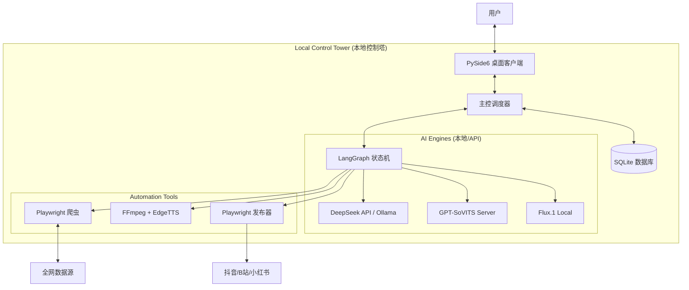

没问题，架构师已就位。

以下是为您生成的两份核心文档：**《产品需求蓝图设计》** 与 **《技术架构设计》**。它们已按标准 Markdown 格式排版，你可以直接复制保存为 `.md` 文件，作为开发指南。

-----

# 文档一：需求蓝图设计 (Product Requirement Blueprint)

**项目名称：** Cyber-Pingshu Workstation (赛博评书自动化工作站)
**版本号：** v2.0 (C/S Desktop Edition)
**作者：** AI 远见架构师
**最后更新：** 2023-10

## 1\. 产品愿景 (Product Vision)

打造一套**单兵作战的桌面端自动化内容工厂**。
通过“旧瓶装新酒”的策略，利用传统的评书艺术形式解构现代科技与社会热点。核心在于构建\*\*“全自动化的数据飞轮”\*\*：从全网热点捕捉，到 AI 风格化演绎，再到全平台自动化发布与反馈学习，实现“无人值守”的内容资产增值。

## 2\. 核心 IP 设定 (Core Identity)

  * **角色名称：** 赛博说书人·零号先生 (Master Zero)
  * **角色设定：** 来自 2077 年的数据考古学家，赛博朋克风格，身穿全息长衫，手持激光醒木。
  * **声音特征：** 原创“烟嗓”音色（避开单田芳声纹风险），语速中等偏慢，注重抑扬顿挫与“留扣子”。
  * **视觉风格：** **Cyber-Ink (赛博水墨风)**。黑白水墨基调 + 霓虹色点缀 + 故障艺术 (Glitch Art)。

## 3\. 用户旅程地图 (User Journey)

1.  **启动 (Start):** 用户打开桌面客户端，点击“启动雷达”。
2.  **决策 (Decide):** 系统自动推荐 Top 5 选题，用户勾选其中 1 个（或全选）。
3.  **生产 (Produce):** 用户点击“开始铸造”，系统进入后台全自动作业（生成脚本 -\> 配音 -\> 配图 -\> 剪辑）。
4.  **预览 (Preview):** 生产完成后弹窗预览，用户进行最终“一键人工确认”。
5.  **分发 (Distribute):** 系统自动登录多个平台账号，完成定时上传发布。
6.  **进化 (Evolve):** 次日系统自动抓取评论数据，优化下一轮的 Prompt 策略。

## 4\. 功能模块详述 (Functional Specs)

### 模块 A：全网雷达 (Content Radar)

  * **F1.1 多源热点采集:** 自动抓取知乎（科技榜）、微博（热搜）、36Kr（快讯）、抖音（热点榜）。
  * **F1.2 智能评分系统:**
      * **机制:** 引入 3 个虚拟编辑 Agent（老学究、乐子人、数据党）对选题进行交叉打分。
      * **输出:** 综合推荐指数（0-10分），自动过滤低质/敏感话题。

### 模块 B：评书铸造车间 (The Forge)

  * **F2.1 风格化脚本引擎:**
      * **结构强制:** 定场诗 -\> 开场白 -\> 正文（三翻四抖） -\> 结尾留扣子 -\> [下回分解]。
      * **术语转译:** 自动将现代科技词汇转化为江湖切口（例：服务器 -\> 藏经阁，Bug -\> 走火入魔，程序员 -\> 符文师）。
  * **F2.2 混合视觉系统 (Hybrid Visuals):**
      * **通用层:** 预设 50+ 张高质量赛博说书人动态循环素材（.mp4），随机轮播（覆盖 70% 时长）。
      * **特写层:** 根据脚本关键情节，实时调用 Flux 生成特写图片（覆盖 30% 时长）。
  * **F2.3 沉浸式听觉:**
      * **TTS:** 语音合成（情感控制）。
      * **音效库:** 自动插入本地音效（醒木、折扇、观众喝彩、电子故障音）。

### 模块 C：合规与合成 (Compliance & Render)

  * **F3.1 离线敏感词审查:** 本地库匹配，确保脚本无违规词。
  * **F3.2 自动化剪辑:**
      * 毫秒级字幕对齐。
      * 自动添加水印。
      * 输出 1080P/60fps 竖屏视频。

### 模块 D：矩阵发布与反馈 (Publish & Feedback)

  * **F4.1 RPA 矩阵发布:** 支持抖音、B站、小红书、视频号。模拟人工操作，含封面上传、标签填写。
  * **F4.2 舆情回采:** 自动采集发布 24h 后的评论区关键词。
  * **F4.3 策略自进化:**
      * 若评论区出现“太啰嗦”，自动下调下一次脚本生成的字数阈值。
      * 若评论区出现“催更”，自动记录该类选题权重 +1。

## 5\. 非功能需求 (NFR)

  * **部署环境:** Windows 10/11 (推荐 NVIDIA RTX 3060 及以上显卡)。
  * **响应性能:** 单视频（1分钟）生成时间 \< 5分钟。
  * **数据隐私:** 所有素材、Cookie、模型文件存储于本地，不上传云端。

-----

# 文档二：架构设计 (Architecture Design)

**项目名称：** Cyber-Pingshu Workstation
**架构模式：** C/S (Client/Server) - 本地富客户端架构
**核心框架：** PySide6 (GUI) + LangGraph (逻辑编排) + Playwright (RPA)

## 1\. 系统拓扑图 (System Topology)



## 2\. 核心技术栈 (Tech Stack)

| 层级 | 技术选型 | 理由 |
| :--- | :--- | :--- |
| **交互层 (UI)** | **PySide6 (Qt)** | 跨平台、支持多线程不卡顿、界面美观专业。 |
| **逻辑层 (Logic)** | **LangGraph** | 处理复杂的循环逻辑（如审核失败重试）、状态管理、人机协同（Human-in-the-loop）。 |
| **数据层 (Data)** | **SQLite** | 轻量级、无需安装服务、单文件存储方便迁移。 |
| **浏览器自动化** | **Playwright** | 比 Selenium 更快，支持无头模式，抗指纹检测能力强。 |
| **多媒体核心** | **FFmpeg (CLI)** | 视频处理工业标准，性能最强。 |
| **大模型接入** | **OpenAI SDK** | 兼容 DeepSeek/Moonshot 等主流 API 格式。 |

## 3\. LangGraph 状态机设计 (State Machine)

这是系统的“大脑”，定义了视频生产的严谨流程。

  * **State Schema (状态定义):**

    ```python
    class AgentState(TypedDict):
        topic: str          # 选题
        script: str         # 脚本
        segments: List[Dict]# 分镜列表
        video_path: str     # 成片路径
        audit_result: bool  # 审核结果
        retry_count: int    # 重试次数
    ```

  * **Workflow Nodes (节点流转):**

    1.  **Selector Node:** 爬取并打分 -\> 输出 `topic`。
    2.  **Writer Node:** 生成评书脚本 -\> 输出 `script`。
    3.  **Auditor Node (Gate):** 检查敏感词。
          * *Condition:* 失败且重试 \< 3次 -\> 回退至 **Writer Node**。
          * *Condition:* 失败且重试 \>= 3次 -\> 终止并报错。
          * *Condition:* 成功 -\> 前进至 **Visual Node**。
    4.  **Visual Node:** 并行生成 Flux 特写图 + 选取通用素材 -\> 输出 `segments`。
    5.  **Render Node:** 调用 FFmpeg 合成 -\> 输出 `video_path`。
    6.  **Human Check (Breakpoint):** **[人机断点]** 等待 UI 确认。
    7.  **Publisher Node:** 执行 RPA 上传。

## 4\. 数据库设计 (Database Schema)

主要包含三张表，用于资产沉淀。

### Table: `topics` (选题库)

| 字段名 | 类型 | 描述 |
| :--- | :--- | :--- |
| `id` | INTEGER PK | 主键 |
| `source_url` | TEXT | 来源链接 |
| `title` | TEXT | 标题 |
| `score_ai` | REAL | AI 评分 (0-10) |
| `status` | TEXT | pending (待处理) / used (已使用) / discarded (弃用) |

### Table: `productions` (作品库)

| 字段名 | 类型 | 描述 |
| :--- | :--- | :--- |
| `id` | INTEGER PK | 主键 |
| `topic_id` | INTEGER FK | 关联选题 |
| `script_content` | TEXT | 脚本全文 |
| `video_path` | TEXT | 本地路径 |
| `created_at` | DATETIME | 创建时间 |

### Table: `feedbacks` (数据回环)

| 字段名 | 类型 | 描述 |
| :--- | :--- | :--- |
| `production_id` | INTEGER FK | 关联作品 |
| `platform` | TEXT | 平台 (douyin/bilibili) |
| `views` | INTEGER | 播放量 |
| `comments_sentiment` | REAL | 评论情感分 (-1 to 1) |
| `extracted_keywords` | JSON | 关键词提取 |

## 5\. 本地目录结构 (File Structure)

```text
CyberPingshu/
├── app.py                  # 启动入口 (PySide6 Main)
├── config.yaml             # 配置文件 (API Key, 路径)
├── core/                   # 核心逻辑
│   ├── graph.py            # LangGraph 工作流定义
│   ├── browser.py          # Playwright 脚本封装
│   └── synthesis.py        # FFmpeg/TTS 调用
├── ui/                     # 界面代码
│   ├── main_window.py
│   └── styles.qss
├── assets/                 # 静态资源 (无需生成的)
│   ├── sfx/                # 音效 (醒木.mp3, 笑声.wav)
│   ├── carousel/           # 通用轮播图/视频 (.mp4)
│   └── profiles/           # 浏览器指纹与Cookie
├── output/                 # 产出物
│   └── {date}_{topic}/     # 单次任务文件夹 (含 img, audio, video)
└── db/
    └── studio.db           # SQLite 数据库
```

## 6\. 关键技术难点与风控 (Risk Mitigation)

1.  **RPA 稳定性 (Anti-Detection):**
      * **方案:** 采用 `undetected-playwright` 库，并保存本地 Browser Profile (保留登录态)，避免频繁扫码登录。加入随机延迟。
2.  **显存溢出 (OOM):**
      * **方案:** 建立**互斥锁 (Mutex)** 机制。当 TTS 或 Flux 在 GPU 上推理时，挂起其他任务；FFmpeg 渲染时优先使用 NVENC 编码。
3.  **视觉重复感 (Visual Fatigue):**
      * **方案:** 利用 `Ken Burns Effect`（镜头推拉摇移）算法处理静态图，确保即使是轮播图，每次的运动轨迹也是随机的，欺骗视觉感官。